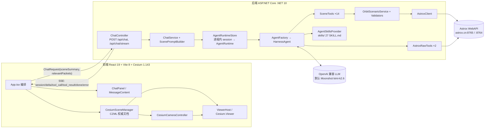
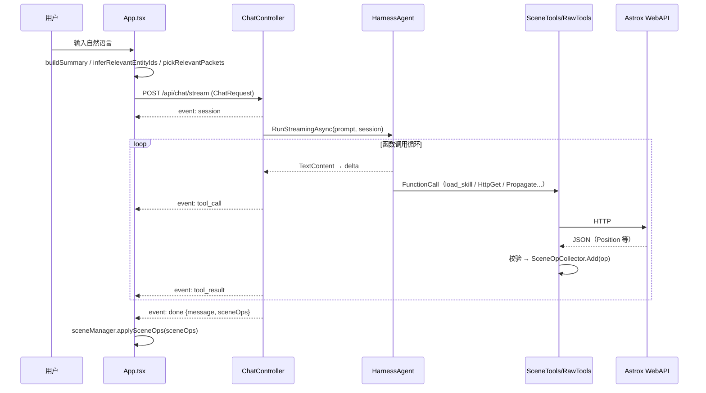
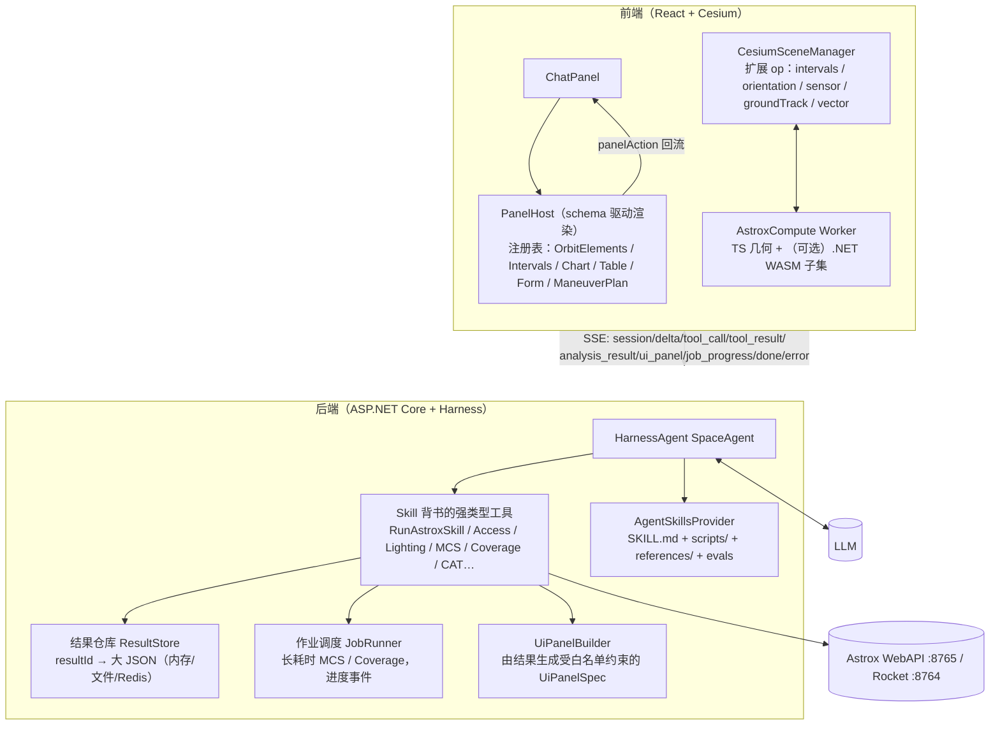
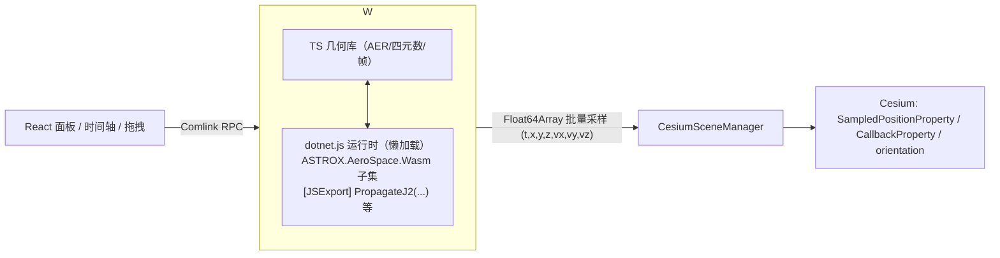
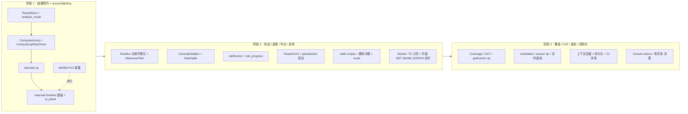

# 航天任务 Agent 调研及技术路径

> 文档状态：调研报告 / 技术路径建议（v1）
> 调研日期：2026-10-07
> 代码基线：`main` @ `8b62cea`；`backend/astrox-skills` submodule @ `8e0ab29`（2026-10-06）
> 目标：借助 Cesium 实现「太空任务智能」——卫星轨道、姿态、飞行过程等均可通过自然语言完成计算与 3D 展示。

---

## 目录

- [0. 执行摘要（五条核心结论）](#0-执行摘要五条核心结论)
- [1. 背景、目标与三条初步思路](#1-背景目标与三条初步思路)
- [2. 现状盘点（基于仓库实际代码）](#2-现状盘点基于仓库实际代码)
  - [2.1 总体架构](#21-总体架构)
  - [2.2 后端：Microsoft.Agents.AI.Harness 架构](#22-后端microsoftagentsaiharness-架构)
  - [2.3 后端工具清单（SceneTools / AstroxRawTools）](#23-后端工具清单scenetools--astroxrawtools)
  - [2.4 Astrox 客户端与数据校验](#24-astrox-客户端与数据校验)
  - [2.5 skills 子模块：27 个 skill 的能力清单与分类](#25-skills-子模块27-个-skill-的能力清单与分类)
  - [2.6 SSE 流式协议](#26-sse-流式协议)
  - [2.7 前端：Cesium 场景操作（sceneOps）与组件结构](#27-前端cesium-场景操作sceneops与组件结构)
  - [2.8 测试体系与 CI](#28-测试体系与-ci)
  - [2.9 当前能力边界与短板](#29-当前能力边界与短板)
- [3. 业界调研](#3-业界调研)
  - [3.1 Cesium 相关的 Agent / LLM 应用](#31-cesium-相关的-agent--llm-应用)
  - [3.2 航天动力学工具的 Agent 化](#32-航天动力学工具的-agent-化)
  - [3.3 .NET → WebAssembly 现状与 ASTROX.AeroSpace 编译可行性](#33-net--webassembly-现状与-astroxaerospace-编译可行性)
  - [3.4 生成式 UI / 动态面板](#34-生成式-ui--动态面板)
  - [3.5 Agent Skills 规范与 Harness 的 skills 机制](#35-agent-skills-规范与-harness-的-skills-机制)
- [4. 改进建议与技术路径](#4-改进建议与技术路径)
  - [4.0 目标架构总览](#40-目标架构总览)
  - [4.1 路径一：加强 Astrox WebApi + Skills（后台非实时计算）](#41-路径一加强-astrox-webapi--skills后台非实时计算)
  - [4.2 路径二：ASTROX.AeroSpace → WASM（前端实时计算）](#42-路径二astroxaerospace--wasm前端实时计算)
  - [4.3 路径三：Cesium 前端「自动 UI 面板」（生成式 UI）](#43-路径三cesium-前端自动-ui-面板生成式-ui)
  - [4.4 跨路径公共基础设施](#44-跨路径公共基础设施)
  - [4.5 优先级、取舍与总路线图](#45-优先级取舍与总路线图)
- [5. 附录](#5-附录)
  - [5.1 参考资料](#51-参考资料)
  - [5.2 术语表](#52-术语表)

---

## 0. 执行摘要（五条核心结论）

1. **现有架构方向正确，但「计算结果只有一种出口」是最大瓶颈。** 仓库已经建立了可靠的「LLM 不手写 CZML、C# Tool 产出结构化 `sceneOps`、前端持有 CZML 权威」的闭环（`SceneTools` 14 个工具 + 5 种 `SceneOp` + 6 种 SSE 事件 + 206/166/7 条后端/前端/e2e 测试）。但 Agent 目前只能把计算结果变成**卫星 position packet**；Astrox WebAPI 的 79 个端点中，access 弧段、光照时间、覆盖 FOM、MCS 机动序列结果、CAT 碰撞分析等「非位置型」结果既没有 `SceneOp` 载体，也没有 UI 载体，27 个 skill 中真正能落到球上的只有 `propagator`/`orbitwizard-*`/`query-tle` 这条链。**优先要补的是结果的数据契约与出口，而不是更多的算法。**

2. **路径一（Astrox WebApi + Skills 做非实时计算）应作为主线，且要从「泛型 HttpPost + SKILL.md 提示」升级为「Skill 背书的强类型工具 + 结果句柄 + 异步作业」。** 业界同类项目（`astrodynamics-mcp`、`gmat-mcp-server`、ESA `dSGP4` MCP、`stk-mcp`）证明「LLM 负责意图、权威库负责数值、每个结果带单位与校验」是正确范式；Harness 的 `AgentSkillsProvider` 已支持 `run_skill_script` 与 MCP skills 源，可直接用于把 fixtures 升级为可执行的请求组装/校验脚本与评测集。

3. **路径二（ASTROX.AeroSpace → WASM）可行但要「选择性」做：只把轻量、无大数据文件依赖的实时计算下沉到浏览器。** .NET 10 已提供不依赖 Blazor 的 `wasmbrowser` + `[JSImport]/[JSExport]` 路径，最小包约 2.0 MB（Brotli），AOT 会使体积翻倍，多线程仍是实验特性，NativeAOT-LLVM 仍在 runtimelab 实验阶段（2026-04 起才开始向 dotnet/runtime 上游提交）。ASTROX 自己的 Cesium 扩展已经要求 `AstroxWasm.setDotnetUrl("/dotnet/_framework/dotnet.js")` 并在浏览器里跑 `TwoBodyPropagator`，说明该库已有 WASM 先例可复用。但 HPOP（EGM2008/GL0900D 引力场文件）、DE430 星历、MCS 微分修正等依赖大数据文件与长时计算的能力**不应**下沉；它们继续留在服务端走路径一。

4. **路径三（自动 UI 面板）推荐采用「声明式 catalog + schema 驱动渲染」而非 iframe/HTML 生成，并复用现有 SSE 与校验基础设施。** 2026 年生成式 UI 已分化为三类：组件选择（Vercel AI SDK）、声明式格式（Google A2UI、Vercel `json-render`、OpenUI）、沙箱 HTML（MCP Apps/MCP-UI、OpenAI Apps SDK）。对本项目最匹配的是声明式格式：由 C# Tool（而非 LLM 自由文本）产出受白名单约束的 `UiPanelSpec`，通过新增 `ui_panel` SSE 事件以 JSON Patch 流式下发，前端用注册表渲染；这与当前 `sceneOps` 的「结构化、服务端校验、前端运行时护栏」思想完全一致，可以共享 `SemanticJsonSize` 等预算机制。

5. **推荐优先级：路径一（含结果契约）→ 路径三 → 路径二（选择性）。** 理由：路径一直接扩展可用能力面且风险最低；路径三让「非位置型结果」有了可视化出口，是路径一价值能否被用户看见的前提；路径二收益集中在交互体验（实时拖动、姿态/视场即时反馈），技术不确定性最高（包体、工具链、库依赖），应先以 Cesium-Astrox 已有的 `AstroxWasm` 或 TS/Rust 替代实现做 PoC 验证收益后再投入。

---

## 1. 背景、目标与三条初步思路

CesiumAI 现状是「自然语言 → Agent → Astrox 轨道计算 → CZML `sceneOps` → Cesium 3D 展示」的 MVP（见 `Docs/prd.md`、`Docs/后端说明.md`、`Docs/前端说明.md`）。用户的下一阶段目标是「太空任务智能」：卫星轨道、姿态、飞行过程、可见性、光照、机动、覆盖等都能用自然语言完成计算并 3D 展示。用户给出三条初步思路：

| 思路 | 内容 | 本报告对应章节 |
|---|---|---|
| ① | 加强 Astrox WebApi 并提供相应 skills，后台调用 skills 做非实时计算 | 3.2、3.5、4.1 |
| ② | 借助 ASTROX.AeroSpace 库，把需要实时计算的功能编译为 WASM 供 JS 前端调用 | 3.3、4.2 |
| ③ | Cesium 3D 前端实现「自动 UI 面板」：根据用户需求动态显示相应 UI（生成式 UI） | 3.4、4.3 |

---

## 2. 现状盘点（基于仓库实际代码）

### 2.1 总体架构



设计原则（`Docs/后端说明.md` §1）：后端不持有场景权威；可执行场景变更只来自强类型 Tools 写入的 `sceneOps`；LLM 不手写星历 CZML；助手文本只负责说明。

### 2.2 后端：Microsoft.Agents.AI.Harness 架构

`backend/CesiumAI.Api/Services/AgentFactory.cs` 用 `Microsoft.Agents.AI.Harness` 1.23.0 的 `IChatClient.AsHarnessAgent(HarnessAgentOptions)` 构建 `SpaceAgent`，关键配置如下（均来自代码）：

| 配置项 | 取值 | 含义 / 原因（代码注释） |
|---|---|---|
| `HarnessInstructions` | `string.Empty` | 关闭 Harness 默认英文通用指令，改由 `AgentInstructions.Text`（6 条中文规则）约束 |
| `ChatOptions.Tools` | 16 个 `AIFunction` | 见 2.3 |
| `DisableWebSearch` | `true` | OpenAI 兼容 Chat Completions 不支持托管搜索 |
| `DisableFileMemory` | `true` | 默认写进程目录 `agent-file-memory/`，IIS 部署不可控 |
| `DisableTodoProvider` / `DisableAgentModeProvider` | `true` | 面向长任务 plan/execute，会注入额外工具与指令，干扰「场景变更只走场景工具」 |
| `DisableAgentSkillsProvider` | `true` + `AIContextProviders=[skillsProvider]` | 用按 content root 解析的 `AgentSkillsProvider(skillsPath, options)` 替换默认按进程目录发现的实例 |
| `AgentSkillsProviderOptions` | `DisableLoadSkillApproval=true`、`DisableReadSkillResourceApproval=true`、`DisableRunSkillScriptApproval=false` | `load_skill`/`read_skill_resource` 免审批；脚本执行保留审批（当前 skills 无 scripts） |
| 循环内压缩 | 未启用 | `MaxContextWindowTokens`/`MaxOutputTokens` 在 1.23.0 为实验 API（MAAI001） |
| `LoopEvaluators` / `BackgroundAgents` | 未使用 | 单轮函数调用循环 |

保留的 Harness 默认能力：函数调用循环、逐次服务调用历史持久化、工具自动审批中间件、OpenTelemetry 装饰器。

其他要点：

- **`ChatHistorySanitizingChatClient`**（`DelegatingChatClient`）：发往 LLM 前清洗历史，修复 kimi 流式首分片空串与中途失败残留 `tool_calls` 导致的 400（见 `CHANGES.md` 2026-10-06）。
- **`AgentRuntimeStore`**：`ConcurrentDictionary<string, Lazy<Task<AgentRuntime>>>` 进程内缓存 session → (`AIAgent`, `AgentSession`, `TurnSceneOpSink`)，每会话一把 `SemaphoreSlim(1,1)` 串行化轮次；`TurnSceneOpSink.Current` 绑定本轮 `SceneOpCollector`。**会话不持久化、不跨进程**。
- **`ScenePromptBuilder`**：把 `[SCENE_SUMMARY]` + `[RELEVANT_CZML_PACKETS]` + `[USER]` 拼成单条 user prompt。
- **配置校验**：`ValidateOnStart`（`Agent:ApiKey`/`Endpoint`/`Model`、`Astrox:BaseUrl`、`Skills:Path` 目录存在、`ReverseProxy:KnownProxies`）；`ChatEndpoint:Timeout` 默认 2 分钟。

### 2.3 后端工具清单（SceneTools / AstroxRawTools）

`AgentFactory.CreateAsync` 注册的 16 个 `AIFunction`：

| # | 工具 | 产出 `SceneOp` | 关键校验 / 约束 |
|---|---|---|---|
| 1 | `ClearScene` | `clear` | — |
| 2 | `UpsertFacility(id,name,lon,lat,alt)` | `upsert`（point+label+`/models/facility.glb`） | 经纬度范围 |
| 3 | `DeleteEntity(ids[])` | `delete` | 过滤 `document` |
| 4 | `AddSatelliteJ2(id,altKm,hours,step,ltdn,epoch)` | `upsert` | `/OrbitWizard/SSO` → `/Propagator/J2`；hours ≤ 24，step 1..3600 |
| 5 | `FocusEntity` | `camera.focus` | 距离 > 0、角度有限 |
| 6 | `TrackEntity` / 7 `StopTracking` | `camera.track` / `untrack` | — |
| 8 | `AdjustCamera(zoom\|pan\|rotate)` | `camera.*` | pan 方向白名单、rotate 至少一角非零 |
| 9 | `OrbitEntity(step\|start)` / 10 `StopOrbit` | `camera.orbitStep/orbitStart/orbitStop` | 角速度 > 0 |
| 11 | `UpdateEntityStyle(id,patchJson)` | `style` | `SceneStyleValidator` 白名单（point/path/label/billboard/model/polyline/polygon/ellipse），禁止外部资源 URI，语义体积 ≤ 32 KiB |
| 12 | `PropagateAndAddSatellite(id,propagatorPath,requestJson,start,stop)` | `upsert` | 仅 `/Propagator/*`；`PropagationRequestValidator` 校验 Start/Stop/Step；大 Position 不回传模型 |
| 13 | `AddSatelliteFromPositions(id,positionJson,start,stop)` | `upsert` | `CzmlPositionValidator` |
| 14 | `PropagateIssAndAddSatellite(id,requestJson,hours,step,epoch)` | `upsert` | 服务端注入 SGP4 的 Start/Stop/Step |
| 15 | `AstroxRawTools.HttpGet(path)` | — | 仅同源根相对路径，多轮解码防穿越 |
| 16 | `AstroxRawTools.HttpPost(path,body)` | — | 同上；**响应体原样返回给模型**（无大小上限） |

另有 Harness skills 工具：`load_skill`、`read_skill_resource`（`run_skill_script` 仅在存在脚本时广告，当前无）。

### 2.4 Astrox 客户端与数据校验

- `AstroxClient`：typed `/OrbitWizard/SSO`、`/Propagator/J2`，以及通用 `PropagateAsync(/Propagator/*)`；响应体上限 typed 64 MiB、通用 2 MiB + 64 KiB；根键大小写规范校验、`IsSuccess` 判定、`Position.cartesian`(stride 4)/`cartesianVelocity`(stride 7) 有限数校验。
- `OrbitScenarioService.BuildSatellitePacket`：固定样式（黄点、青色 path、`/models/satellite.glb`、`properties.orbitHint`）。
- `CzmlPositionValidator`：Position ≤ 2 MiB、样本 ≤ 10 000、availability ≤ 24 h。
- `SemanticJsonSize`（前后端共享算法）：语义预算 32 KiB。

### 2.5 skills 子模块：27 个 skill 的能力清单与分类

`backend/astrox-skills/skills/` 共 27 个 skill 目录 + `shared-docs/`（15 份 API schema 文档）。构建时由 `CesiumAI.Api.csproj` 的 `SyncAstroxSkillsIntoContentRoot` 目标同步到 `backend/CesiumAI.Api/skills/`。每个 skill 为 `SKILL.md`（YAML frontmatter `name`/`description` + 核心指令 + API 规范 + 执行流程）+ `fixtures/*.json`，**没有 `scripts/`**。

| 分类 | skill | 对应 Astrox 端点 | 当前能否落到 Cesium 场景 |
|---|---|---|---|
| 轨道递推与弹道 | `propagator`（TwoBody/J2/HPOP/SGP4） | `/Propagator/{TwoBody,J2,HPOP,sgp4}` | ✅ 经 `PropagateAndAddSatellite` |
| | `propagator-simple-ascent` | `/Propagator/SimpleAscent` | ✅（同上，输出 CzmlPositionOut） |
| | `propagator-ballistic` | `/Propagator/Ballistic` | ✅（同上） |
| 轨道设计与机动 | `astrogator`（MCS：Launch/InitialState/Propagate/Impulsive/Finite/TargetSequence/Follow；地月转移、LOI、Halo、DRO、霍曼） | `/Astrogator/RunMCS` | ⚠️ 结果为分段 `MCSSegmentResults`，无专用 Tool；只能靠 `HttpPost` + 模型手工拆出 position 再喂 `AddSatelliteFromPositions`（大 JSON 往返模型） |
| | `lambert` | `/orbit/lambert` | ❌ 纯数值（DV1/DV2），无出口 |
| | `celestial-transfer` | `/celestial/transfer` | ❌ 转移窗口网格（porkchop 类数据），无出口 |
| | `rocket-trajectory-optim` | `:8764 /Rocket/TrajectoryOptim` | ❌ 默认服务端口与 `Astrox:BaseUrl` 不同，`AstroxRawTools` 同源限制下**不可达** |
| 根数 ↔ 状态向量 | `kepler2rv` / `rv2kepler` | `/OrbitConvert/Kepler2RV`、`/RV2Kepler` | ❌ 纯数值 |
| Orbit Wizard | `orbitwizard-sso/geo/molniya/walker` | `/OrbitWizard/*` | ⚠️ SSO 有 typed 路径；GEO/Molniya/Walker 需模型把根数再喂 `/Propagator/*`；Walker 多星需多次调用 |
| 可见性/光照/访问 | `access` | `/access/AccessComputeV2` | ❌ 时间区间 + AER 采样，无出口 |
| | `lighting-times` / `lighting-solar-aer` / `lighting-solar-intensity` | `/Lighting/*` | ❌ |
| | `terrain-mask` | `/Terrain/AzElMask*` | ❌ |
| 天体星历与坐标 | `celestial-ephemeris` / `celestial-mpc` | `/celestial/ephemeris`、`/mpc` | ⚠️ 输出 CZML Position，但中心天体非地球，标准 Cesium Viewer 无多天体 |
| | `celestial-cbaxes-rotation` | `/celestial/CbAxesRotation` | ❌ 四元数/角速度（姿态相关），无出口 |
| | `convert-czml-position` | `/OrbitSystem/ConvertCzmlPosition` | ⚠️ |
| 平动点 | `libration` | `/libration/*`（7 端点） | ❌ 无量纲会合系轨迹 |
| 数据查询 | `query-city` / `query-facility` / `query-tle` | `GET /city`、`/facility`、`/ssc` | ✅ `query-tle` 用于 ISS 流程；`query-facility` 结果可经 `UpsertFacility` 上球 |
| Cesium | `cesium-astrox` | （非 API）ASTROX 扩展版 Cesium 用法 | ❌ 当前前端用的是**原版** Cesium 1.143，不是 Cesium-Astrox |

**OpenAPI 覆盖度**：`astrox-web-api.json`（OpenAPI 3.1.1，「ASTROX Web API(.Net 10)」2026-09-28）共 **79 个路径、314 个 schema**；`rocket-web-api.json` 另有 14 个路径。**尚无 skill 覆盖**的端点组：

- `/CAT/*`（CA_ComputeV3/V4 碰撞分析、DebrisBreakup*、GetTLE、LifeTimeTLE）——6 个
- `/Coverage/*`（ComputeCoverage、GetGridPoints、FOM GridStats/ValueByGridPoint/OverTime/AtTime × 5 种 FOM、Report）——22 个
- `/access/ChainCompute`、`/Propagator/{MultiJ2,MultiSgp4,MultiTwoBody,TwoBodyRV}`、`/OrbitConvert/{CalGEOYMLambertDv,GetKozaiIzsakMeanElements,Kepler2LLAAtAscendNode}`、`/OrbitSystem/EarthMoonLibration{,2}`、`/LandingZone`、`/InterfaceClass`、`GET /satcat`

**frontmatter 合规性**（本次脚本核对 27 份 `SKILL.md`）：`lighting-solar-aer/SKILL.md` 没有合法的 YAML frontmatter（`---` 后紧跟空行与 `## name:` 标题），Harness 的 `AgentFileSkillsSource` 无法解析其 `name`/`description`，该 skill 实际**不会被广告给模型**；`convert-czml-position/SKILL.md` 的 `name: convert-czmlPosition` 与目录名不一致且含大写，不符合 agentskills.io 规范（名称须为小写 kebab-case 且与目录一致）。两处均需在上游 `blitheli/astrox-skills` 修正后更新 submodule 指针。

**`raw/` 目录的线索**：300+ 份上游 C# 测试代码引用 `ASTROX.Coordinates/Time/Celestial/Geometry/Propagators/SegmentPropagation/StoppingConditions/NumericalMethods` 与 `AeroSpace.Propagator/OrbitCore/Celestial/Libration/MathLib/IO` 等命名空间，类型命名与 AGI STK Components/Astrogator 高度同构（`NumericalPropagatorSegment`、`TargetedSegmentListDifferentialCorrector`、`ImpulsiveManeuverSegment`、`AgVAElement*`）。HPOP 依赖 `EGM2008.grv`/`GL0900D.grv`/`MRO110C.grv` 引力场文件与 JPL DE430 星历；这些是评估 WASM 可行性的关键输入（见 3.3）。

### 2.6 SSE 流式协议

`POST /api/chat/stream`（`ChatController.Stream` → `ChatService.StreamAsync`），`event:` 为事件名、`data:` 单行 JSON；事件顺序约定 `session → (delta | tool_call | tool_result)* → done | error`。

| 事件 | 载荷 | 说明 |
|---|---|---|
| `session` | `{sessionId}` | 首事件；请求未带时服务端新建 |
| `delta` | `{text}` | 助手文本增量（`TextReasoningContent` 推理内容不下发） |
| `tool_call` | `{callId,name}` | 仅进度展示，不带参数 |
| `tool_result` | `{callId,succeeded}` | 不带结果内容（避免大型星历进浏览器） |
| `done` | `{sessionId,message,sceneOps}` | 与非流式 `ChatResponse` 同形；**`sceneOps` 只在本轮成功结束时一次性下发** |
| `error` | `{error,detail}` | `agent_timeout` / `agent_error`（HTTP 200 已发出后的失败） |

前端 `api/chat.ts` 的 `streamChat` 自带 SSE 帧解析（CRLF/跨 chunk/多字节 UTF-8）并**忽略未知事件名**（向前兼容，便于新增 `ui_panel` 等事件）；`toStreamEvent` 做运行时契约校验，`done` 中畸形 `sceneOps` 整体拒绝。



### 2.7 前端：Cesium 场景操作（sceneOps）与组件结构

目录与职责（`frontend/src/`）：

| 模块 | 文件 | 职责 |
|---|---|---|
| 契约 | `contracts/chat.ts` | `SceneOp`（`clear/upsert/delete/camera/style`）、`ChatRequest/Response`、`ChatStreamEvent` |
| API | `api/chat.ts`、`api/sceneOpsRuntime.ts` | SSE 客户端；运行时护栏 `isSceneOpArray`（未知 op 整体拒绝，camera 参数逐 action 校验） |
| 场景 | `scene/CesiumSceneManager.ts`（751 行） | 内存 CZML 权威文档；`applySceneOps` 串行队列、`structuredClone`、upsert/style 失败回滚（`load` 旧文档 + 恢复时钟/跟踪）；`availability` 对齐 `document.clock` |
| | `scene/sceneDocument.ts` | 纯文档归约（camera 在此层抛错） |
| | `scene/sceneStyle.ts` | style 白名单 + 深合并（与后端 `SceneStyleValidator` 对齐） |
| | `scene/summary.ts` | `buildSceneSummary`（设施经纬高、卫星 `orbitHint`）、`inferRelevantEntityIds`、`pickRelevantPackets` |
| | `scene/CesiumCameraController.ts`（948 行） | focus/track/untrack/zoom/pan/rotate/orbit |
| 组件 | `components/ViewerHost.tsx` | 创建**原版** `Cesium.Viewer`（animation/timeline/baseLayerPicker/geocoder 等全开，可选 ion token） |
| | `components/ChatPanel.tsx`、`MessageContent.tsx` | 聊天 UI；`react-markdown` + `remark-gfm` 渲染助手回复，不渲染原始 HTML |
| 编排 | `app/App.tsx` | 处理 6 种流事件（`tool_call` → 「正在调用工具 X…」活动提示），`done` 后 `applySceneOps`；测试开关 `VITE_ENABLE_TEST_DIAGNOSTICS` 暴露只读诊断 |
| 构建 | `vite.config.ts` | 读取 `CHANGES.md` 最新日期标题注入 `__APP_LAST_UPDATED__` |

### 2.8 测试体系与 CI

| 层 | 框架 | 规模（本次统计） | 覆盖重点 |
|---|---|---|---|
| 后端单元/集成 | xUnit + `WebApplicationFactory`（`ApiFactory`）+ `StubHttpMessageHandler` | 206 个 `[Fact]/[Theory]` | 工具参数校验、Astrox 响应校验、SSE 控制器、历史清洗、Moonshot 多轮回归、Skills 启动校验 |
| 前端单元/组件 | Vitest 4 + Testing Library + jsdom | 166 个 `it/test` | 契约与运行时护栏、SceneManager（含回滚）、相机控制器、样式白名单、SSE 解析、ChatPanel/Markdown |
| 端到端 | Playwright（自启 Vite，mock `/api/chat/stream`） | 7 个 test | 副标题日期、Markdown、clear、设施增改、卫星一天轨迹、相机/样式保持 ISS 位置 |
| CI/CD | GitHub Actions `deploy-backend.yml` / `deploy-frontend.yml` | push `main` 触发 | `dotnet publish` / `npm run build`；**未在 CI 跑测试** |

工具链：`npm run lint`（oxlint）、`npm run typecheck`、`dotnet test CesiumAI.slnx`。

### 2.9 当前能力边界与短板

**能力边界**（能做）：清空/地面站增删改/三种建星路径（SSO-J2 快捷、通用 `/Propagator/*`、ISS-SGP4）/相机 9 种动作/视觉样式补丁/查询城市、设施、TLE/通过 `load_skill` 阅读 27 份 skill 文档并用受限 `HttpGet/HttpPost` 探索 Astrox。

**短板**（按影响排序）：

1. **结果出口单一**：`SceneOp` 只有 5 种，计算结果唯一能上球的形态是「卫星 position packet」。Access 区间、光照区间、AER 序列、覆盖网格、MCS 分段结果、Lambert ΔV、根数、四元数姿态都没有数据契约与可视化/面板出口。
2. **`HttpPost` 是一条无护栏的「万能通道」**：响应原样回传模型，MCS/HPOP 大 JSON 会灌进上下文；且仅同源，`:8764` 火箭服务不可达。
3. **无姿态与视场**：CZML 的 `orientation`、传感器锥体（Cesium 需自绘或 ion SDK）、`cbaxes-rotation` 结果均无承载。
4. **无多天体 / 非地心场景**：原版 Cesium 单地球；地月转移、月球轨道、日心小行星只能以地心惯性系位置「勉强」显示。
5. **时间窗口硬上限 24 h、样本 ≤ 10 000、Position ≤ 2 MiB**：地月转移（数天）、GEO 多日、覆盖分析（天级）会被 `CzmlPositionValidator`/`OrbitScenarioService` 拒绝。
6. **sceneOps 仅在 `done` 一次性下发**：长任务（MCS、覆盖）用户只能等到最后；无作业/进度语义；`ChatEndpoint:Timeout` 2 分钟封顶。
7. **会话仅进程内**：重启/多实例即丢；无用户/项目维度的场景持久化。
8. **skills 无 scripts、无 evals，且资源不可读**：fixtures 只是示例，不能被 Agent 执行用于「组装 + 校验请求」；`fixtures/`、`docs/`、`examples/`、`shared-docs/` 都不在 Harness 默认资源目录内，模型只能读到 `SKILL.md` 正文；没有度量「模型是否选对 skill / 填对参数」的回归集；另有 1 份 SKILL.md 因 frontmatter 非法而对模型不可见、1 份 name 不合规（见 2.5）。
9. **UI 固定**：聊天面板 + Viewer，无结果表格/图表/参数表单；`tool_result` 不含任何可展示内容。
10. **CI 不跑测试**；LLM 单供应商（OpenAI 兼容 Chat Completions），结构化输出/工具调用能力受模型差异影响。

---

## 3. 业界调研

> 检索时间 2026-10-07；来源链接与日期见各小节与附录 5.1。

### 3.1 Cesium 相关的 Agent / LLM 应用

| 项目 | 性质 | 要点 | 来源（日期） |
|---|---|---|---|
| **CesiumJS Sandcastle Copilot** | Cesium 官方，内置于 Sandcastle 的 AI 聊天面板 | BYOK（Gemini/Claude/Vertex）；模型**只有一个编辑工具 `apply_diff`**，不输出自由代码文本；控制台感知自动修错；流式思考与工具调用；Roo 风格 diff 容错。官方称后续将「扩展 Cesium-aware skills」 | [cesium.com 博客](https://cesium.com/blog/2026/07/07/introducing-cesiumjs-sandcastle-copilot/)（2026-07-07）；[PR #13188](https://github.com/CesiumGS/cesium/pull/13188) |
| **CesiumGS/cesium-ai-integrations** | Cesium 官方参考集成仓库 | `mcp/cesium-js/servers/`：camera / entity / animation / imagery / geolocation 五个 MCP server；`mcp-apps/codegen`（代码生成）与「Interactive 3D globe」MCP App；`skills/` Agent Skills；外部 Context7、Discourse MCP。**未见 Cesium ion 官方 MCP server** | [GitHub](https://github.com/CesiumGS/cesium-ai-integrations)（2026） |
| **gaopengbin/cesium-mcp** | 社区，最活跃的 Cesium MCP 实现 | `cesium-mcp-runtime`：62 个命令工具 / 12 toolsets（camera、entity、layer、tiles、animation、trajectory、heatmap、scene…）+ 动态发现；浏览器侧 `cesium-mcp-bridge` 经 WebSocket 执行；`cesium-mcp-webmcp` 走浏览器原生 `document.modelContext`（WebMCP）；`setIonToken`、`ionAssetId` 加载 3D Tiles/影像；支持 MCP 2025-11-25 与 2026-07-28 协议。其 `examples/browser-agent` 明确指出：**浏览器应用已知自己的工具，MCP 传输层不增值，直接用 function calling + 命令分发即可** | [GitHub](https://github.com/gaopengbin/cesium-mcp/)、[文档](https://gaopengbin.github.io/cesium-mcp/)（2026） |
| **MCP Apps** | MCP 官方首个扩展（SEP-1865，源自社区 MCP-UI） | 工具结果引用 `ui://` HTML 资源，宿主在沙箱 iframe 渲染，`postMessage` 通信；宿主含 Claude、ChatGPT Apps、VS Code Copilot 等 | [MCP 博客](https://blog.modelcontextprotocol.io/posts/2026-01-26-mcp-apps/)（2026-01-26） |

**对本项目的启示**

- Cesium 官方与社区实现都把「相机 / 实体 / 图层 / 动画 / 时钟」做成**细粒度、带 JSON Schema 的命令工具**，这与本仓库 `SceneTools → SceneOp` 的做法一致；可借鉴其 toolset 分组与动态发现以缓解工具数量增长带来的 prompt 膨胀。
- Sandcastle Copilot 验证了「模型只拥有一个受约束的结构化工具」的安全模式，与本仓库「场景变更只走工具」理念相同。
- 本仓库前端是「单一已知应用」，**不需要**引入 MCP 传输；但 Cesium 官方 skill 与 Context7 文档 MCP 可用于开发态（辅助编写 Cesium 代码）。

### 3.2 航天动力学工具的 Agent 化

| 项目 | 底层 | Agent 化方式 | 要点 | 来源 |
|---|---|---|---|---|
| **astro-tools/astrodynamics-mcp** | sgp4、Lambert、SPICE、可选 GMAT | MCP server（stdio / Streamable HTTP） | TLE/SGP4 多参考系、Lambert、地面站 access、时间/坐标转换、porkchop、B-plane；`[gmat]` 扩展 `gmat_run_mission`/sweep/Monte Carlo；**每个结果带显式单位；工具描述针对 Inspect AI 评测集调优**，衡量「模型是否选对工具、绑对参数」 | [GitHub](https://github.com/astro-tools/astrodynamics-mcp)（2026） |
| **gmat-mcp-server** | NASA GMAT（GmatConsole 无头） | MCP server | `runGmat` 返回分类结果 `completed\|parse\|convergence\|run` + 错误 + 报告，形成 write→run→diagnose→fix 闭环；`getGmatIdioms` 人工整理的「坑」知识库；`searchDocs` 本地向量检索 | [GitHub](https://github.com/ginomoretta-creator/gmat-mcp-server)（2026） |
| **ESA dSGP4 MCP** | 可微 SGP4（PyTorch） | 库内置可选 MCP server | 6 个域：tle / propagation / gradients（6×9 雅可比、协方差）/ estimation（TLE 拟合）/ ml / plot（PNG）；附 `dsgp4://reference/...` 资源与多工具工作流 prompts | [esa.github.io/dSGP4](https://esa.github.io/dSGP4/mcp.html)（v1.4.0，2026） |
| **alti3/stk-mcp** | Ansys/AGI STK Engine/Desktop | MCP server（FastMCP） | `setup_scenario`、`create_location`、`create_satellite`、access 分析、LLA 星历；Windows/Linux Engine 双模式 | [GitHub](https://github.com/alti3/stk-mcp) |
| Orekit / Basilisk / hapsira(poliastro) | — | **未见专用 MCP/Agent 集成** | Basilisk v2.12.0（2026-09）活跃但只有 ROS 2 桥与 bsk-sdk 插件；poliastro 2023-10 归档，hapsira 停滞，`boinor` 为维护中的继承者 | [Basilisk releases](https://github.com/AVSLab/basilisk/releases)；[hapsira](https://github.com/pleiszenburg/hapsira) |
| NASA Earth Copilot / ESA EVE | Azure OpenAI / 24B 领域 LLM | 数据发现问答 | 面向地球观测数据，**不是任务设计 Agent** | [Microsoft 博客](https://blogs.microsoft.com/blog/2024/11/14/from-questions-to-discoveries-nasas-new-earth-copilot-brings-microsoft-ai-capabilities-to-democratize-access-to-complex-data/)（2024-11-14）；[EVE](https://eve.philab.esa.int/a-domain-specific-llm-framework-for-earth-intelligence/) |
| sidereon / astroz | Rust / Zig 引擎 | 浏览器 WASM、Python、C 绑定 | sidereon：SGP4 位精确 Vallado 移植、数值递推（球谐引力、三体、SRP、NRLMSISE-00 阻力）、passes、覆盖、OD，WASM 版驱动 sidereon.dev 实时跟踪；astroz：SIMD 多线程 SGP4，Cesium 可视化全目录 1.3 万星 | [sidereon-wasm](https://github.com/neilberkman/sidereon-wasm)；[astroz](https://g.itadn.com/repos/ATTron/astroz) |

**共性范式**：① LLM 只做意图解析与参数绑定，数值由权威库完成；② 结果结构化、带单位、带分类状态（成功/解析失败/不收敛）；③ 配套「领域 idioms / 参考资源 / 工作流 prompt」降低误用；④ 用评测集度量工具选择与参数绑定的正确率。本仓库的 `astrox-skills` 已具备 ②③ 的雏形（SKILL.md + shared-docs + fixtures），缺的是可执行脚本、评测与结构化结果出口。

### 3.3 .NET → WebAssembly 现状与 ASTROX.AeroSpace 编译可行性

#### 3.3.1 技术现状（截至 2026-10）

| 方案 | 状态 | 关键事实 | 来源 |
|---|---|---|---|
| **Blazor WebAssembly（.NET 10）** | GA | 构建期 Brotli 预压缩、资产指纹、`<link rel=preload>`、`blazor.boot.json` 并入 `dotnet.js`、运行时诊断；`WasmStripILAfterAOT` 默认开启 | [.NET 10 preview4 说明](https://github.com/dotnet/core/blob/main/release-notes/10.0/preview/preview4/aspnetcore.md)；[Copilot Studio 迁移 .NET 10](https://devblogs.microsoft.com/dotnet/copilot-studio-dotnet-10-migration/) |
| **不依赖 Blazor 的 WebAssembly Browser App**（`Microsoft.NET.Sdk.WebAssembly` + `wasm-experimental` 模板） | API 自 .NET 8 受支持，模板仍标「experimental」 | `[JSImport]/[JSExport]`（`System.Runtime.InteropServices.JavaScript`）；需 `AllowUnsafeBlocks`；可嵌入既有 JS 应用、与 bundler 配合（`WasmEnableHotReload=false`） | [Microsoft Learn](https://learn.microsoft.com/en-us/aspnet/core/client-side/dotnet-interop/wasm-browser-app?view=aspnetcore-10.0)（更新 2025-12） |
| **包体** | — | 最小模板发布：6.8 MB 未压缩 / 2.0 MB Brotli；`InvariantGlobalization` 后 4.3 MB / 1.4 MB | [Andrew Lock](https://andrewlock.net/running-dotnet-in-the-browser-without-blazor/)（.NET 10 preview 6） |
| **AOT（Mono LLVM AOT）** | GA，默认关 | 大幅提升 CPU 密集性能，但体积约翻倍、启动变慢；AOT+解释器混合存在转换开销（泛型实例、含 try/finally 的方法可能落回解释器） | [runtime features.md](https://github.com/dotnet/runtime/blob/main/src/mono/wasm/features.md)；[issue #60247](https://github.com/dotnet/runtime/issues/60247) |
| **多线程** `WasmEnableThreads` | 实验 | 需 `SharedArrayBuffer` + COOP/COEP 头；Blazor 集成有缺口 | [features.md](https://github.com/dotnet/runtime/blob/main/src/mono/wasm/features.md) |
| **NativeAOT-LLVM** | runtimelab 实验分支；2026-04 起向 `dotnet/runtime` 上游提交 | 启动极快、计算/互操作更快；但包体更大（Avalonia 实测 LLVM 95 MB vs Mono AOT 50 MB vs 解释器 25 MB，去调试信息 40 MB）；多线程不可用 | [runtimelab 文档](https://github.com/dotnet/runtimelab/blob/feature/NativeAOT-LLVM/docs/workflow/building/coreclr/nativeaot.md)；[PR #126633](https://github.com/dotnet/runtime/pull/126633)（2026-04-08）；[Avalonia #16211](https://github.com/AvaloniaUI/Avalonia/issues/16211) |

**JS 互操作限制**：`[JSImport]/[JSExport]` 仅支持有限的参数类型映射（基元、string、`JSObject`、数组、`Task`、`Action/Func`），大数组应以 `double[]`/`Span` 批量传递或使用共享内存视图；主线程调用会阻塞渲染，CPU 密集任务应放入 Web Worker。

#### 3.3.2 ASTROX.AeroSpace 编译为 WASM 的可行性评估

**有利证据**

- `skills/cesium-astrox/SKILL.md` 记录 Cesium-Astrox 场景初始化**必选** `await Cesium.AstroxWasm.setDotnetUrl("/dotnet/_framework/dotnet.js")`，且浏览器端已有 `Cesium.TwoBodyPropagator(...).toCzmlPosition(...).getCzmlPostions()`、`CzmlPositionHelper`——说明 ASTROX 团队已把部分 .NET 计算编译为 WASM 并在 Cesium 扩展中使用，工具链与互操作模式有先例。
- 库为纯托管 C#（`raw/` 中的测试仅依赖 `System.Text.Json`、MSTest，少量 ScottPlot/Newtonsoft 仅在测试里），无原生 P/Invoke 迹象；Web API 自称 `.Net 10`，与 WASM 目标框架一致。

**不利因素 / 风险**

| 风险 | 说明 | 缓解 |
|---|---|---|
| 大数据文件依赖 | HPOP 需 `EGM2008.grv`（数十 MB 级完整阶次）、`GL0900D.grv`、`MRO110C.grv`；DE430 星历（约 100 MB 级，可裁剪时间段）；地形遮罩依赖 `astrox.cn:8765/TerrainDb` 服务 | 浏览器端只做二体/J2/SGP4/低阶引力；DE430 用服务端预裁剪的短窗口切片或改用解析星历（VSOP/ELP 近似） |
| 包体与启动 | 运行时 ≥ 2 MB Brotli + 库 IL + 数据；AOT 翻倍 | 懒加载（仅在需要实时计算时 `import()`）；`InvariantGlobalization`；按功能切分程序集；只对热点方法 AOT（Mono profile-guided AOT）或接受解释执行 |
| 性能 | 解释器执行数值积分比原生慢 1 个数量级以上；AOT+解释混合转换开销 | 热路径避免 LINQ/泛型值类型实例；向量化到 `double[]` 批处理；Worker 中后台计算、主线程只取采样 |
| 库依赖面 | 反射（`System.Reflection` 在 raw 测试中大量出现）、`System.Text.Json` 源生成缺失会触发裁剪告警；多线程 `Parallel` 在 WASM 单线程下退化 | 开启 trimming 警告为错误；为 JSON 契约加 `JsonSerializerContext`；禁用并行 |
| 工具链成熟度 | `wasmbrowser` 模板仍 experimental；NativeAOT-LLVM 不可用于生产 | 使用 Mono 运行时 GA 路径；不依赖 NativeAOT-LLVM |
| 双实现一致性 | 浏览器端与服务端算法版本漂移 | 同一 Git 源、同一 NuGet 版本号；在 e2e 中以服务端结果为基准做容差回归 |

**结论**：可行，但应**只把「实时、轻量、无大文件依赖」的子集**编译进浏览器——时间系统与坐标系转换、Kepler↔RV、二体/J2/SGP4 位置速度采样、AER/视线几何、四元数姿态合成、简单传感器视场几何。HPOP、MCS/微分修正、覆盖、CAT、地形遮罩继续走服务端。

#### 3.3.3 替代/互补方案对比

| 方案 | 适用 | 优点 | 缺点 |
|---|---|---|---|
| **A. .NET WASM（Mono 运行时，`wasmbrowser`）** | 复用 ASTROX.AeroSpace 子集 | 单一代码源、与服务端一致、团队熟悉 C# | 包体最大（≥2 MB 起）、解释执行慢、需 Worker 隔离 |
| **B. 复用 Cesium-Astrox 的 `AstroxWasm`** | ASTROX 自有 Cesium 扩展 | 现成的 `TwoBodyPropagator`、`CzmlPositionHelper`、多天体 `SolarSystem`、`OrbitsGraphics`、`path.groundTracks` | 需整体切换到定制版 Cesium（与原版 1.143 API 差异，现有 e2e/单测需适配）；闭源、版本跟进依赖 ASTROX |
| **C. Rust/C++ → WASM**（sidereon-wasm、satellite.js WASM、astroz） | SGP4/二体/数值递推、通量型 | 包体小（百 KB 级）、性能高（satellite.js WASM 零分配批处理；sidereon 位精确 Vallado） | 与 ASTROX 算法/口径不一致；需再做一致性验证；增加语言栈 |
| **D. TypeScript 原生实现 + Web Worker** | 轻量几何（AER、视线、四元数、根数转换） | 零额外运行时、最易测试 | 复杂算法重写成本高、精度/一致性风险 |
| **E. 服务端流式计算（SSE/WebSocket 推采样）** | 一切重计算、需权威结果的场景 | 零前端依赖、与路径一同栈 | 交互延迟（RTT）、带宽、服务端算力 |

推荐组合：**E 为默认**（路径一）；**D 立即可做**（姿态/AER/视场等几何在前端即时反馈）；**A 做 PoC**，仅在 D 覆盖不了且需与 ASTROX 严格一致的实时项（如 J2/SGP4 的 `CallbackProperty` 实时采样）上使用；**B** 作为重大架构选项单独评估（它同时解决多天体问题，但切换成本大）。

### 3.4 生成式 UI / 动态面板

| 方案 | 类型 | 机制 | 适用 / 限制 | 来源 |
|---|---|---|---|---|
| **Vercel AI SDK（`streamUI` / 组件选择）** | 组件选择 | 注册 React 组件，模型选组件并流式传 props；2026 初 Vercel 将重心转向 `json-render`，RSC 直流式方案暂停 | Next.js/React 绑定；适合自家 Web 产品 | [HiA2UI 对比](https://hia2ui.com/blog/a2ui-vs-vercel-ai-sdk/)（2026）；[框架综述](https://themobilereality.com/blog/ai/generative-ui-frameworks/) |
| **Vercel Labs `json-render`** | 声明式格式 | `defineCatalog`（Zod 组件/动作目录）→ 模型输出受约束 JSON 树 → `defineRegistry` 映射 React 组件渲染；**SpecStream：JSONL + RFC 6902 JSON Patch 流式**；`useUIStream`；内置 `setState`/`validateForm` 动作与 `$bindState` 双向绑定；React/Vue/Svelte/Solid/RN 渲染器 | 开源 Apache 2.0；轻量、与现有 React 栈契合 | [GitHub](https://github.com/vercel-labs/json-render)；[Streaming 文档](https://json-render.dev/docs/streaming) |
| **Google A2UI** | 声明式格式/协议 | 模型输出扁平、ID 引用的 JSON 组件列表（JSONL 流），宿主用**受信组件目录**原生渲染；与 MCP 结合用 `a2ui://` URI；Lit/Angular/Flutter 官方渲染器，React 社区渲染器 | 跨平台原生；组件库受限；适合企业安全隔离 | [Google 开发者博客](https://developers.googleblog.com/en/a2ui-and-mcp-apps/)（2026） |
| **MCP Apps / MCP-UI** | 沙箱 HTML | 工具结果引用 `ui://` HTML 资源，宿主在 iframe sandbox 渲染，`postMessage` JSON-RPC；CSP 由服务端声明、宿主强制 | 表达力最强（任意 HTML/JS），但隔离、审查成本高；主要用于「跨宿主分发」 | [MCP 博客](https://blog.modelcontextprotocol.io/posts/2026-01-26-mcp-apps/)（2026-01-26）；[OpenUI 报告](https://www.openui.com/blog/state-of-generative-ui-report) |
| **OpenAI Apps SDK** | MCP Apps 的 ChatGPT 实现 | 从 MCP Apps 共享字段起步，加 `window.openai` 扩展 | 仅 ChatGPT 分发 | [Applied Technology Index 对比](https://appliedtechnologyindex.com/research/2026-comparative-analysis-agent-user-interface-protocols-generative-ui/)（2026） |
| **AG-UI** | 传输协议 | 标准化 agent↔前端事件流（`RUN_STARTED`、`TEXT_MESSAGE_CONTENT`、`TOOL_CALL_*`、`STATE_*`）；**Microsoft Agent Framework 提供 `MapAGUIServer` 把任意 `AIAgent` 暴露为 AG-UI SSE 端点** | 可替代自定义 SSE 事件名，但现有 6 事件已足够小而稳 | [Microsoft Learn AG-UI](https://learn.microsoft.com/en-us/agent-framework/integrations/by-component/ui/ag-ui/?pivots=programming-language-csharp) |
| **Microsoft Agent Framework 结构化输出** | 模型侧 | `AIAgent.RunAsync<T>()` / `AgentRunOptions.ResponseFormat = ChatResponseFormat.ForJsonSchema<T>()`；也可用原始 JSON Schema 字符串（ADR 0016） | 适合让模型产出「面板意图」的小结构；大数值仍应由 Tool 产出 | [Learn 结构化输出](https://learn.microsoft.com/en-us/agent-framework/agents/structured-outputs)；[ADR 0016](https://github.com/microsoft/agent-framework/blob/main/docs/decisions/0016-structured-output.md) |

**对本项目的结论**：选「**声明式 catalog**」路线（json-render/A2UI 思想），而且**面板 spec 由 C# Tool 基于计算结果生成**（模型只决定「要不要/用哪种面板」），不让模型逐字段手写数值——这是 `sceneOps` 设计原则在 UI 维度的自然延伸。不采用 iframe HTML 方案（本项目单宿主，无跨宿主分发需求，隔离成本不值）。

### 3.5 Agent Skills 规范与 Harness 的 skills 机制

- **Agent Skills 开放规范**（Anthropic 发起，[agentskills.io](https://agentskills.io/home)、[GitHub agentskills/agentskills](https://github.com/agentskills/agentskills)）：skill = 含 `SKILL.md`（frontmatter `name`/`description` 必填）的目录，可带 `scripts/`、`references/`、`assets/`；**渐进披露三阶段**：Discovery（只载 name/description）→ Activation（读全文）→ Execution（运行脚本/读引用）。
- **Microsoft Agent Framework 实现**（[Learn: Agent Skills](https://learn.microsoft.com/en-us/agent-framework/agents/skills)、[`AgentSkillsProvider` API](https://learn.microsoft.com/en-us/dotnet/api/microsoft.agents.ai.agentskillsprovider?view=agent-framework-dotnet-latest)）：
  - `AgentSkillsProvider` 是 `AIContextProvider`，向系统提示注入 skill 名称/描述，注册 `load_skill`、`read_skill_resource`、`run_skill_script`（有脚本时）三个工具；
  - 来源（`AgentSkillsSource`）：文件系统 `AgentFileSkillsSource`（`scripts/`、`references/`、`assets/` 子目录自动发现，可过滤扩展名）、代码内联 `AgentInlineSkill`、类定义 `AgentClassSkill<T>`（`[AgentSkillResource]`/`[AgentSkillScript]` 特性）、**MCP skills 源 `UseMcpSkills`**；`AgentSkillsProviderBuilder` 组合聚合/去重/缓存/过滤装饰器；
  - 脚本执行需提供 `AgentFileSkillScriptRunner` 委托，审批策略由 `AgentSkillsProviderOptions` 控制（`ReadOnlyToolsAutoApprovalRule` / `AllToolsAutoApprovalRule`）；
  - 1.23.0 程序集中已包含上述全部类型（本次从 NuGet 包 XML 文档核对）。
- **Harness 其他可用能力**（[Learn: Agent Harness](https://learn.microsoft.com/en-us/agent-framework/agents/harness)）：`TodoProvider` + `AgentModeProvider`（plan/execute）、`LoopEvaluators`（`TodoCompletionLoopEvaluator`、`AIJudgeLoopEvaluator`、`CompletionMarkerLoopEvaluator`）、`BackgroundAgents`（后台委托）、上下文压缩策略（`ContextWindowCompactionStrategy`、`ToolResultCompactionStrategy`、`SummarizationCompactionStrategy`）、`FileAccessStore`。本仓库目前全部关闭或未用。

**与当前仓库对照**：`astrox-skills` 完全符合规范的「Discovery/Activation」两阶段，但没有 `scripts/`（无法 Execution）；Harness 默认只把 `references/`、`assets/` 下的 `.md/.json/.yaml/.yml/.csv/.xml/.txt` 识别为资源，因此现有 `fixtures/`、`astrogator/docs/`、`libration/docs/`、`cesium-astrox/examples/` 都**不能**被 `read_skill_resource` 读取，除非在 `AgentFileSkillsSourceOptions` 中加入这些目录名或改为规范目录；`shared-docs/` 不是 skill，模型无法直接读取其中的 API schema（除非 SKILL.md 内联或迁入各 skill 的 `references/`）。本仓库的 `AgentFactory` 目前使用默认 `AgentFileSkillsSourceOptions`，模型实际只能看到每个 skill 的 `SKILL.md` 正文。

---

## 4. 改进建议与技术路径

### 4.0 目标架构总览



三条路径在该架构中的落点：路径一 = `SKT + RES + JOBS + SKILLS`；路径三 = `UIT + PANELS + ui_panel 事件`；路径二 = `WORKER`。

### 4.1 路径一：加强 Astrox WebApi + Skills（后台非实时计算）

#### 4.1.1 架构设计

1. **「Skill 背书的强类型工具」（Skill-backed Typed Tools）**
   把当前「模型读 SKILL.md → 自己拼 JSON → `HttpPost` → 自己解析」的模式，改为每类能力一个 C# 工具：模型只填**小参数**（实体 id、时间窗口、对象引用、少数标量），工具负责（a）按 skill 的 fixtures 模板组装完整请求；（b）调用 Astrox；（c）用对应 `shared-docs/api-schemas` 校验响应；（d）把结果写入 `ResultStore` 并产出 `SceneOp` / `UiPanelSpec`；（e）只向模型回传**摘要**（如「access 共 7 段，总时长 1h23m，最长 14m」+ `resultId`）。
   与 Astrox 端点的映射优先级（按用户目标与现有 skill）：

   | 优先级 | 工具 | 端点 | 产出 |
   |---|---|---|---|
   | P0 | `ComputeAccess(fromId,toId,start,stop,step,computeAer)` | `/access/AccessComputeV2` | `intervals` op（可见弧段高亮/时间轴）+ Intervals 面板 + AER 曲线面板 |
   | P0 | `ComputeLightingTimes(id,start,stop)` | `/Lighting/LightingTimes` | `intervals`（本影/半影/日照）+ 面板 |
   | P0 | `RunMcs(mcsJson 或 由 skill 脚本生成)` | `/Astrogator/RunMCS` | 多段 `upsert`（每段一条 path，按段上色）+ ManeuverPlan 面板（ΔV、质量、历元） |
   | P1 | `GenerateWalker(T,P,F,seed)` → 批量 `/Propagator/*` 或 `/Propagator/MultiJ2` | `/OrbitWizard/Walker` + `MultiJ2` | 多星 `upsert` + Table 面板 |
   | P1 | `ComputeCoverage(gridDef, assets, fom)` | `/Coverage/*` | 新 `grid` op（点/多边形着色）+ Chart 面板 |
   | P1 | `ConjunctionAssessment(...)` | `/CAT/CA_ComputeV4` | Table 面板 + `vector`/高亮 op |
   | P1 | `Kepler2Rv/Rv2Kepler/Lambert` | `/OrbitConvert/*`、`/orbit/lambert` | OrbitElements/KeyValue 面板 |
   | P2 | `CelestialEphemeris/Transfer`、`Libration` | `/celestial/*`、`/libration/*` | 需多天体支持（见 4.2 方案 B）或以地心/日心惯性系近似展示 |
   | P2 | `RocketTrajectoryOptim` | `:8764` | 需为 `AstroxRawTools`/`AstroxClient` 增加**多 origin 白名单**配置（`Astrox:Services[]`） |

2. **结果仓库与引用句柄**：`IResultStore`（默认内存 LRU + 可选文件/Redis），`resultId` 作为模型可引用的小 token；后续工具（如「把第 3 段访问弧段飞过去」「把这段 MCS 的第 2 个机动放大」）以 `resultId + 索引`取数据，避免大 JSON 再次经过模型。
3. **长耗时作业**：对 MCS、Coverage、CAT 引入 `JobRunner`（`Channel<T>` + `BackgroundService`）；工具立即返回 `jobId`，SSE 以 `job_progress` 推进度，完成后以 `analysis_result` + `sceneOps` 增量下发（见 4.1.2）。同时放宽 `ChatEndpoint:Timeout` 对作业的约束（作业独立于一轮对话）。
4. **收紧 `HttpPost`**：加响应大小上限（如 256 KiB）与结果自动落 `ResultStore` 的「大响应改回传摘要 + resultId」行为；保留其作为 skill 探索通道。
5. **放宽校验边界**：`CzmlPositionValidator` 的 24 h / 10 000 样本 / 2 MiB 按用途分档（LEO 实时 1 天 vs. 地月转移 7 天 vs. 覆盖 30 天），超限时服务端做**降采样 + Hermite/Lagrange 阶数**提示，而不是直接拒绝。
6. **skills 子模块升级**（上游 `blitheli/astrox-skills`）：
   - 先修正 `lighting-solar-aer` 的 frontmatter 与 `convert-czml-position` 的 `name`（见 2.5），并在后端 `SkillsOptionsValidator` 启动校验中增加「每个 skill 目录的 frontmatter 可解析」检查，避免 skill 静默消失；
   - 为高频 skill 增加 `scripts/`（建议 Python 或 .NET 脚本）：`build_request.py --fixture ... --set Start=...`、`validate_response.py`，由 `run_skill_script` 执行（需实现 `AgentFileSkillScriptRunner`，沙箱内运行，白名单解释器与超时）；
   - `fixtures/` 迁入或映射为 `references/`（或在 `AgentFileSkillsSourceOptions` 中加入 `fixtures` 资源目录），`shared-docs/api-schemas` 以 `references/` 形式挂到相关 skill；
   - 补 CAT、Coverage、ChainCompute、MultiSgp4/MultiJ2、satcat 等缺失 skill；
   - 新增 `evals/`：每 skill 若干「自然语言 → 期望端点 + 关键参数」用例，后端测试用 `StubHttpMessageHandler` 回放，度量工具选择/参数绑定正确率（借鉴 astrodynamics-mcp 的 Inspect 评测思路）。

#### 4.1.2 接口 / 协议设计

**新增 `SceneOp`**（后端 `SceneOps.cs` `JsonDerivedType` + 前端 `contracts/chat.ts` + `sceneOpsRuntime.ts` 护栏 + `sceneDocument.ts` 归约）：

```jsonc
// 时间区间集合：访问弧段 / 光照 / 任务阶段；落为 CZML availability 片段或 path 分段上色
{ "op": "intervals", "id": "acc-sanya-iss", "kind": "access|lighting|phase",
  "targetId": "iss", "sourceId": "sanya",
  "intervals": [{ "start": "...Z", "stop": "...Z", "label": "Pass 1", "color": [0,255,0,200] }] }

// 姿态：CZML orientation（unitQuaternion 采样）
{ "op": "orientation", "id": "sat-1", "epoch": "...Z", "unitQuaternion": [0, x,y,z,w, 60, ...] }

// 传感器视场：锥/矩形，前端以 Cesium 几何（或自定义 Primitive）绘制
{ "op": "sensor", "id": "sat-1-cam", "parentId": "sat-1", "type": "conic|rectangular",
  "halfAngleDeg": 15, "range": 2000000, "color": [255,255,0,80] }

// 地面轨迹 / 覆盖网格 / 向量（指向太阳、ΔV 方向）
{ "op": "groundTrack", "id": "sat-1-gt", "targetId": "sat-1", "show": true }
{ "op": "grid", "id": "cov-1", "points": [[lon,lat,value], ...], "colormap": "viridis", "range": [0,1] }
{ "op": "vector", "id": "dv-1", "parentId": "sat-1", "epoch": "...Z", "direction": [x,y,z], "frame": "VNC|ICRF", "lengthMeters": 500000 }
```

**新增 SSE 事件**（`ChatStreamEvents.cs` + 前端 `toStreamEvent`；前端已忽略未知事件，向后兼容）：

| 事件 | 载荷 | 时机 |
|---|---|---|
| `analysis_result` | `{resultId, kind, summary, units, schemaRef}` | 工具产出结构化结果后立即推送（不等 `done`） |
| `job_progress` | `{jobId, phase, percent, message}` | 长作业进度 |
| `scene_ops` | `{sceneOps:[...], partial:true}` | 增量场景更新（可选；默认仍在 `done` 一次性下发以保持「失败不留半套场景」语义，仅作业完成时使用） |
| `ui_panel` | 见 4.3 | 面板 spec 创建/补丁/移除 |

`done` 保持兼容：`{sessionId, message, sceneOps, panels?: UiPanelSpec[] , results?: ResultRef[]}`。

#### 4.1.3 分阶段里程碑

| 阶段 | 内容 | 验收 |
|---|---|---|
| **MVP** | `IResultStore`；`ComputeAccess`、`ComputeLightingTimes` 两个 P0 工具；`intervals` op + 前端归约/渲染（path 分段上色 + 时间轴标注）；`analysis_result` 事件；`HttpPost` 响应上限；多 origin 配置 | 「三亚站未来 24 小时对 ISS 的可见窗口」一句话得到弧段高亮 + 文本摘要；e2e 覆盖 |
| **增强** | `RunMcs`（分段 upsert + ΔV 摘要）、`GenerateWalker`、`JobRunner` + `job_progress`、校验边界分档与降采样、skills `scripts/`+`AgentFileSkillScriptRunner` 沙箱 | 地月转移 MCS fixture 一句话出轨迹（7 天窗口）；Walker 24/3/1 一句话 24 星；作业超过 2 分钟不超时 |
| **成熟** | Coverage/CAT 工具与 `grid`/`vector` op；evals 回归集进 CI；上下文压缩（`ToolResultCompactionStrategy`）；Harness `TodoProvider` 用于多步任务编排 | 评测集工具选择准确率 ≥ 95%；20 轮以上长会话不因上下文爆掉 |

#### 4.1.4 工作量（按改动面，不含日历估计）

| 项 | 规模 | 涉及 |
|---|---|---|
| 结果仓库 + `analysis_result` + `HttpPost` 收紧 | S | `Services/ResultStore.cs`、`ChatStreamEvents.cs`、`AstroxRawTools.cs`、前端 `chat.ts` |
| P0 两个工具 + `intervals` op | M | `Tools/AnalysisTools.cs`、`Astrox/AstroxClient.cs`（新 typed 端点）、`Models/SceneOps.cs`、前端 `sceneDocument/sceneStyle/CesiumSceneManager`、测试 |
| `RunMcs` 分段可视化 | M–L | MCS 结果解析（`MCSSegmentResults*` 多态）、多段 packet、ΔV 摘要 |
| `JobRunner` + 进度事件 | M | `BackgroundService`、会话-作业关联、取消 |
| skills scripts/evals + 脚本沙箱 | M | 上游 submodule PR + 后端 `AgentFileSkillScriptRunner` |
| Coverage/CAT + `grid`/`vector` | L | 新 skill、新 op、前端自定义 Primitive |

#### 4.1.5 风险与替代

- Astrox 服务可用性/限流（公网 `astrox.cn`）→ 结果缓存 + 失败分类回传模型；考虑私有化部署选项。
- 模型工具数量膨胀（16 → 30+）→ 借鉴 cesium-mcp 的 toolset 动态启用（Harness 可按 `AIContextProvider` 动态注入工具），或按意图分组路由。
- MCS 请求复杂（314 schema）→ 不要让模型直接写全量 MCS JSON；用 skill 脚本从「模板 + 参数覆盖」生成。

### 4.2 路径二：ASTROX.AeroSpace → WASM（前端实时计算）

#### 4.2.1 适合/不适合下沉的功能

| 适合（实时、轻量、无大文件） | 不适合（继续服务端） |
|---|---|
| 时间系统（UTC/TAI/TT/UT1 近似）与坐标系转换（ICRF↔Fixed，低精度 IAU 模型） | HPOP（EGM2008/GL0900D 引力场、DE430 第三体、NRLMSISE 大气） |
| Kepler↔RV、根数派生量（周期、近/远地点、地方时） | Astrogator MCS、微分修正、Lambert 网格搜索（porkchop） |
| 二体 / J2 / SGP4 的 `CallbackProperty` 实时采样（拖时间轴、改根数即时重绘） | 覆盖 FOM、CAT、碎片解体 |
| AER / 视线 / 简单 access 预测（近似地球模型）、太阳方位（低精度解析星历） | 地形遮罩（依赖 TerrainDb 服务） |
| 姿态：四元数合成、LVLH/VNC/VVLH 基向量、传感器视场几何 | 高精度 DE430 天体星历、多天体转换（除非切片数据） |

#### 4.2.2 架构设计



- 独立 C# 项目 `ASTROX.AeroSpace.Wasm`（`Microsoft.NET.Sdk.WebAssembly`，`net10.0`，`AllowUnsafeBlocks`，`InvariantGlobalization`，`PublishTrimmed`，`WasmEnableHotReload=false` 以兼容 Vite 打包），仅引用 ASTROX 的 Propagators/Coordinates/Time 子集；`[JSExport]` 暴露批量接口（输入/输出 `double[]`，避免逐点互操作）。
- 前端 `workers/astroxCompute.ts` 用 Comlink 封装；运行时通过 `vite-plugin-static-copy` 复制 `_framework/` 到 `/dotnet/`，首次需要时 `import("/dotnet/_framework/dotnet.js")`。
- `CesiumSceneManager` 新增「本地计算源」实体：`position` 由 Worker 采样填充 `SampledPositionProperty`（仍然同步回内存 CZML 文档以保持权威一致），参数变更走防抖重算。
- 一致性验证：同一组 fixture 在服务端 `/Propagator/J2` 与 WASM 端对比，位置误差阈值（如 < 1 m / 24 h）进入 Vitest/e2e。

#### 4.2.3 分阶段里程碑

| 阶段 | 内容 | 验收 |
|---|---|---|
| **PoC** | 用 `wasmbrowser` 模板把 ASTROX 二体 + Kepler↔RV 编译为 WASM；测包体（目标 ≤ 3 MB Brotli 含运行时）、首载时间、1 天/60 s 采样耗时；同时用 TS 实现 AER/四元数作对照 | 给出三组数据（包体/启动/计算），决定是否继续 |
| **MVP** | Worker + Comlink；J2/SGP4 实时采样接入 `SampledPositionProperty`；「调整轨道高度/倾角滑块即时重绘」面板联动（依赖 4.3 Form 面板） | 滑块拖动 < 100 ms 内重绘 1 天轨迹 |
| **增强** | 姿态（orientation）与传感器视场实时；低精度太阳方向；本地 access 粗预测用于「先预览、再服务端精算」 | 姿态/视场跟随时间轴实时变化 |
| **成熟** | 选择性 AOT（热点方法）、多线程（若浏览器与部署满足 COOP/COEP）、与服务端结果容差回归进 CI | 性能回归基线稳定 |

#### 4.2.4 工作量

| 项 | 规模 | 说明 |
|---|---|---|
| PoC 工程与度量 | S–M | 新 C# 项目、裁剪告警修复、度量脚本 |
| Worker + Comlink + 懒加载 | S | 前端基础设施 |
| `SampledPositionProperty`/`orientation` 接入 SceneManager | M | 保持 CZML 权威与回滚语义 |
| TS 几何库（AER/四元数/帧） | M | 可先于 WASM 落地 |
| 一致性回归 | S | 服务端 vs. WASM 容差测试 |

#### 4.2.5 风险与替代

- **包体/启动**：≥ 2 MB Brotli 起步；若 PoC 超预算，退回方案 D（TS）或 C（sidereon-wasm/satellite.js WASM 做 SGP4/二体），仅在严格一致性场景用服务端。
- **库裁剪与反射**：ASTROX 若大量使用反射/动态 JSON，需 `JsonSerializerContext` 源生成或 `TrimmerRootAssembly`；由 ASTROX 维护方配合。
- **双实现漂移**：锁版本 + 回归测试。
- **架构级替代（方案 B）**：切换到 Cesium-Astrox（已含 `AstroxWasm`、多天体 `SolarSystem`、`OrbitsGraphics`、`groundTracks`、月球影像/地形），可一并解决多天体与地月转移展示；但与原版 Cesium API 差异需重写 `ViewerHost` 并适配 e2e，属重大决策，建议独立评估。

### 4.3 路径三：Cesium 前端「自动 UI 面板」（生成式 UI）

#### 4.3.1 设计原则

1. **声明式 + 目录白名单**：面板只能由注册表中的组件构成（json-render/A2UI 思想）；
2. **spec 由工具生成，模型只选面板类型**：数值、单位、时间全部来自 `ResultStore`/工具结果，模型不逐字段手写；模型可用结构化输出（`RunAsync<T>` / `ResponseFormat`）产出「面板意图」小对象（`{panelKind, resultId, options}`），由 `UiPanelBuilder` 渲染成 spec；
3. **与 `sceneOps` 同一事务语义**：面板与场景变更在同一轮内一致提交；失败时不留半套面板；
4. **可交互回流**：面板上的滑块/按钮/表单产生 `panelAction`，作为下一轮 `ChatRequest.panelAction` 回传后端（或直接触发前端本地 Worker 计算——与路径二联动），形成「说—看—调—再算」闭环；
5. **复用预算与护栏**：spec 语义体积沿用 `SemanticJsonSize` 32 KiB；运行时 `isUiPanelSpec` 护栏；文本字段经 Markdown 安全渲染（复用 `MessageContent`）。

#### 4.3.2 面板目录（首批）

| 组件 | 用途 | 关键 props | 动作 |
|---|---|---|---|
| `OrbitElementsCard` | 六根数 + 派生量（周期、近/远地点、LTDN） | `elements`, `epoch`, `frame`, `units` | `editElements` → Form |
| `IntervalsTimeline` | 访问/光照/任务阶段区间 | `intervals[]`, `clockSync` | `flyToInterval(i)`、`setClock(t)` |
| `SeriesChart` | AER / 高度 / 光照强度随时间 | `series[]`（降采样后 ≤ N 点）, `axes` | `hover → setClock` |
| `DataTable` | Walker 星座、CAT 事件、Lambert 解 | `columns`, `rows`（分页） | `selectRow → focusEntity` |
| `ParamForm` | 轨道/机动参数表单 | `fields[]`（范围、步进、单位） | `submit → panelAction`（后端重算 / Worker 实时） |
| `ManeuverPlan` | MCS 分段、ΔV、质量、历元 | `segments[]` | `focusSegment(i)` |
| `KeyValueCard` / `Markdown` | 通用摘要 | — | — |

#### 4.3.3 协议设计

```jsonc
// SSE event: ui_panel
{ "action": "upsert", "panel": {
    "id": "acc-1", "type": "IntervalsTimeline", "title": "三亚 → ISS 可见窗口",
    "resultId": "res_01H...", "layout": { "dock": "right", "order": 1 },
    "props": { "intervals": [ ... ], "clockSync": true },
    "actions": [ { "name": "flyToInterval", "label": "飞到该弧段" } ] } }
{ "action": "patch", "id": "acc-1", "patch": [ { "op": "replace", "path": "/props/intervals/0/label", "value": "Pass 1 (14m)" } ] }  // RFC 6902
{ "action": "remove", "id": "acc-1" }
```

- 流式：`patch` 使用 RFC 6902 JSON Patch（与 json-render SpecStream 一致），前端用 `fast-json-patch` 等库应用；
- `done.panels` 携带最终态（断线重连/非流式客户端可一次性拿到）；
- 回流：`ChatRequest` 增加 `panelAction?: { panelId, name, payload }`，`ScenePromptBuilder` 以 `[PANEL_ACTION]` 段注入；对「实时」动作（滑块）前端先走 Worker 本地计算，提交时再请求服务端精算。

#### 4.3.4 分阶段里程碑

| 阶段 | 内容 | 验收 |
|---|---|---|
| **MVP** | `UiPanelSpec` 契约（前后端）+ 运行时护栏；`PanelHost` + `IntervalsTimeline`/`KeyValueCard`；`ui_panel` upsert/remove；与 4.1 MVP 的 access 结果联动；`done.panels` | 一句话出可见窗口面板，点击弧段相机飞过去并对齐时钟；e2e 覆盖 |
| **增强** | `OrbitElementsCard`、`SeriesChart`、`DataTable`、`ParamForm` + `panelAction` 回流；JSON Patch 流式；面板布局持久化（localStorage） | 修改根数表单 → 后端重算 → 场景与面板同步更新 |
| **成熟** | `ManeuverPlan`；模型结构化「面板意图」（`RunAsync<T>`）用于开放式问题；面板与 Worker 实时计算联动 | 「对比两条轨道的覆盖」等开放式需求自动组合多个面板 |

#### 4.3.5 工作量

| 项 | 规模 | 涉及 |
|---|---|---|
| 契约 + 护栏 + `ui_panel` 事件 + `done.panels` | S | `Models/UiPanels.cs`、`ChatStreamEvents.cs`、`contracts/chat.ts`、`api/chat.ts` |
| `PanelHost` + 2 个组件 + 布局 | M | `components/panels/*`、`App.tsx`、样式 |
| 5 个增强组件 + `panelAction` 回流 | M–L | 组件、`ChatRequest`、`ScenePromptBuilder`、工具参数 |
| JSON Patch 流式 | S | 依赖库 + 增量 reducer |

#### 4.3.6 风险与替代

- **模型「幻觉面板」**：面板只能由工具创建，模型无直接写 spec 的工具；若需开放式组合，用结构化输出 + 白名单校验。
- **面板与场景状态不一致**：统一由 `done`（或作业完成事件）原子提交；面板 `resultId` 失效时显示「结果已过期」。
- **替代**：若未来需要把面板分发到 Claude/ChatGPT 等外部宿主，可在 `UiPanelSpec` 之上加一层 MCP Apps（`ui://`）适配，而不必改内部契约。

### 4.4 跨路径公共基础设施

| 能力 | 建议 | 相关 Harness/生态能力 |
|---|---|---|
| 会话与场景持久化 | `AgentSession` 序列化 + `ResultStore` 外置（Redis/文件）；场景 CZML 快照与会话绑定（支持重启恢复、分享链接） | Harness 自带 `ChatHistoryProvider`（可替换） |
| 上下文控制 | 工具结果压缩（`ToolResultCompactionStrategy`）、`MaxContextWindowTokens`（待 API 稳定） | Agent Framework Compaction |
| 可观测 | 保留 OpenTelemetry；记录每轮工具调用、Astrox 延迟、结果体积；日志中屏蔽大 JSON | Harness OTel 装饰器 |
| 评测 | skills `evals/` + 后端回放测试；前端 e2e 以 mock SSE 覆盖新事件 | 借鉴 astrodynamics-mcp Inspect 评测 |
| 多模型 | 抽象 `IChatClient` 工厂（已具备）；对结构化输出/工具调用能力做能力探测与降级 | `Microsoft.Agents.AI.OpenAI` / 其他 provider 包 |
| CI | 在 workflows 中加入 `dotnet test`、`npm test -- --run`、`npm run e2e`（Playwright 已可 mock 后端） | — |
| 多 origin | `Astrox:Services` 列表（astrox :8765、rocket :8764、terrain :8766/8767），`AstroxRawTools`/`AstroxClient` 按白名单解析 | — |

### 4.5 优先级、取舍与总路线图

**推荐顺序：路径一（含结果契约与 `intervals` op）→ 路径三（面板 MVP 紧随 access/lighting 落地）→ 路径二（先 PoC，视数据决定投入）。**

取舍理由：

1. **价值/风险比**：路径一在既有栈上扩展，风险最低、能力面扩张最大（从 1 条可视化链路到 access/lighting/MCS/Walker 多条）；路径三是路径一结果「可见」的必要条件，二者应成对交付；路径二的收益是交互流畅度与离线能力，而非新能力，且技术不确定性最高。
2. **依赖关系**：路径三的 `ParamForm` 实时联动依赖路径二的 Worker；但路径三 MVP（展示型面板）不依赖路径二。路径二 PoC 可与路径一并行进行，不阻塞。
3. **架构一致性**：三条路径都遵循「结构化、服务端校验、前端护栏、CZML 权威在前端」原则，避免引入 iframe/任意代码执行。
4. **重大备选需单独决策**：切换到 Cesium-Astrox（方案 B）牵动多天体、WASM 与前端全部渲染层，应在路径二 PoC 数据与用户对地月/深空需求优先级明确后再定。



**验收指标（总览）**

| 维度 | 指标 |
|---|---|
| 能力面 | 可通过自然语言完成并可视化的 Astrox 端点组：从 1 组（Propagator）→ 阶段 1 结束 3 组 → 阶段 3 结束 ≥ 7 组 |
| 正确性 | skills evals 工具选择/参数绑定准确率 ≥ 95%；WASM 与服务端一致性误差阈值内 |
| 性能 | SSE 首字节 < 1 s；access 24 h 计算到面板呈现 < 10 s；实时滑块重绘 < 100 ms；WASM 首载 ≤ 3 MB Brotli |
| 健壮性 | 长作业不受 2 分钟超时限制；失败不留半套场景/面板；20 轮长会话可用 |
| 质量 | 新增 op/事件/面板均有后端单测、前端单测与 e2e；CI 跑全部测试 |

---

## 5. 附录

### 5.1 参考资料

**仓库内**

- `Docs/prd.md`、`Docs/后端说明.md`、`Docs/前端说明.md`、`frontend/src/scene/CesiumSceneManager.md`、`CHANGES.md`
- `backend/astrox-skills/README.md`、`AGENTS.md`、`CLAUDE.md`、`claude.json`、`astrox-web-api.json`（OpenAPI 3.1.1，2026-09-28）、`rocket-web-api.json`、`skills/cesium-astrox/SKILL.md`
- NuGet 包 XML 文档：`Microsoft.Agents.AI` 1.23.0、`Microsoft.Agents.AI.Harness` 1.23.0

**Cesium 与 AI**

- Cesium, *Introducing CesiumJS Sandcastle Copilot*, 2026-07-07. https://cesium.com/blog/2026/07/07/introducing-cesiumjs-sandcastle-copilot/
- CesiumGS/cesium PR #13188 *Add Sandcastle Copilot AI Assistant*. https://github.com/CesiumGS/cesium/pull/13188
- Cesium, *Cesium Releases in August 2026*, 2026-08-04. https://cesium.com/blog/2026/08/04/cesium-releases-in-august-2026/
- CesiumGS/cesium-ai-integrations（MCP servers、MCP Apps、skills）. https://github.com/CesiumGS/cesium-ai-integrations
- gaopengbin/cesium-mcp（62 tools / 12 toolsets，WebMCP）. https://github.com/gaopengbin/cesium-mcp/ ；文档 https://gaopengbin.github.io/cesium-mcp/
- MCP 官方博客 *MCP Apps*, 2026-01-26. https://blog.modelcontextprotocol.io/posts/2026-01-26-mcp-apps/

**航天动力学 Agent 化**

- astro-tools/astrodynamics-mcp. https://github.com/astro-tools/astrodynamics-mcp
- ginomoretta-creator/gmat-mcp-server. https://github.com/ginomoretta-creator/gmat-mcp-server
- ESA dSGP4 1.4.0 *MCP server (LLM/agent integration)*. https://esa.github.io/dSGP4/mcp.html
- alti3/stk-mcp. https://github.com/alti3/stk-mcp
- NASA GMAT（GitHub 镜像，2026-03）. https://github.com/nasa/gmat
- AVSLab/basilisk Releases（v2.12.0，2026-09-21）. https://github.com/AVSLab/basilisk/releases
- pleiszenburg/hapsira（poliastro fork，0.18.0 2023-12-24）. https://github.com/pleiszenburg/hapsira
- Microsoft, *NASA's new Earth Copilot*, 2024-11-14. https://blogs.microsoft.com/blog/2024/11/14/from-questions-to-discoveries-nasas-new-earth-copilot-brings-microsoft-ai-capabilities-to-democratize-access-to-complex-data/
- ESA Φ-lab EVE. https://eve.philab.esa.int/a-domain-specific-llm-framework-for-earth-intelligence/
- neilberkman/sidereon-wasm. https://github.com/neilberkman/sidereon-wasm
- nyx-space/anise（0.10.1，2026-05-13）. https://github.com/nyx-space/anise
- satellite.js, *WASM: Making the Fastest SGP4 for the web*. https://shashwatak.github.io/satellite-js/blog/wasm
- ATTron/astroz（Zig，Cesium 全目录可视化示例）. https://g.itadn.com/repos/ATTron/astroz
- astrox-python（ASTROX Web API Python SDK，v1.2.2）. https://pypi.org/project/astrox-python/

**.NET → WebAssembly**

- Microsoft Learn, *JavaScript [JSImport]/[JSExport] interop with a WebAssembly Browser App project*（aspnetcore-10.0）. https://learn.microsoft.com/en-us/aspnet/core/client-side/dotnet-interop/wasm-browser-app?view=aspnetcore-10.0
- Microsoft Learn, *JavaScript [JSImport]/[JSExport] interop in .NET WebAssembly*（2025-12-19）. https://github.com/dotnet/AspNetCore.Docs/blob/main/aspnetcore/client-side/dotnet-interop/index.md
- dotnet/core, *.NET 10 Preview 4 ASP.NET Core release notes*. https://github.com/dotnet/core/blob/main/release-notes/10.0/preview/preview4/aspnetcore.md
- .NET Blog, *Copilot Studio gets faster with .NET 10 on WebAssembly*. https://devblogs.microsoft.com/dotnet/copilot-studio-dotnet-10-migration/
- Andrew Lock, *Running .NET in the browser without Blazor*（.NET 10 preview 6）. https://andrewlock.net/running-dotnet-in-the-browser-without-blazor/
- dotnet/runtime, *src/mono/wasm/features.md*. https://github.com/dotnet/runtime/blob/main/src/mono/wasm/features.md
- dotnet/runtime issue #60247 *Webassembly performance problems in aot+interp mode*. https://github.com/dotnet/runtime/issues/60247
- dotnet/runtimelab NativeAOT-LLVM 构建文档. https://github.com/dotnet/runtimelab/blob/feature/NativeAOT-LLVM/docs/workflow/building/coreclr/nativeaot.md
- dotnet/runtime PR #126633 *Upstream WASM native AOT runtime from feature/NativeAOT-LLVM*（2026-04-08）. https://github.com/dotnet/runtime/pull/126633
- dotnet/runtime PR #132143 *Enable wasm compilations in native aot*. https://github.com/dotnet/runtime/pull/132143
- AvaloniaUI/Avalonia #16211 *Running Avalonia Browser on NativeAOT-LLVM*. https://github.com/AvaloniaUI/Avalonia/issues/16211
- DarthPedro, *Blazor WASM in .NET 10 has Faster Startup*, 2025-10-02. https://darthpedro.net/2025/10/02/blazor-wasm-in-net-10-has-faster-startup/
- JacobPersi/Blazor-Multithreaded-PWA（.NET 10 `WasmEnableThreads`）. https://github.com/JacobPersi/Blazor-Multithreaded-PWA

**生成式 UI**

- vercel-labs/json-render. https://github.com/vercel-labs/json-render ；Streaming 文档 https://json-render.dev/docs/streaming
- Google Developers Blog, *A2UI + MCP Apps*（2026）. https://developers.googleblog.com/en/a2ui-and-mcp-apps/
- OpenUI, *The State of Generative UI in 2026*. https://www.openui.com/blog/state-of-generative-ui-report
- Applied Technology Index, *2026 Comparative Analysis: Agent-to-User Interface Protocols*. https://appliedtechnologyindex.com/research/2026-comparative-analysis-agent-user-interface-protocols-generative-ui/
- HiA2UI, *A2UI vs. Vercel AI SDK (2026 Edition)*. https://hia2ui.com/blog/a2ui-vs-vercel-ai-sdk/
- The Mobile Reality, *Top Generative UI Frameworks 2026*. https://themobilereality.com/blog/ai/generative-ui-frameworks/

**Microsoft Agent Framework / Agent Skills**

- Microsoft Learn, *Agent Harness*. https://learn.microsoft.com/en-us/agent-framework/agents/harness
- Microsoft Learn, *Planning and Todos*. https://learn.microsoft.com/en-us/agent-framework/agents/planning-and-todos
- Microsoft Learn, *Agent looping*. https://learn.microsoft.com/en-us/agent-framework/agents/looping
- Microsoft Learn, *Agent Skills*. https://learn.microsoft.com/en-us/agent-framework/agents/skills
- Microsoft Learn, *AgentSkillsProvider Class*. https://learn.microsoft.com/en-us/dotnet/api/microsoft.agents.ai.agentskillsprovider?view=agent-framework-dotnet-latest
- Microsoft Learn, *Producing Structured Outputs with agents*. https://learn.microsoft.com/en-us/agent-framework/agents/structured-outputs
- microsoft/agent-framework ADR 0016 *Structured Output*. https://github.com/microsoft/agent-framework/blob/main/docs/decisions/0016-structured-output.md
- Microsoft Learn, *AG-UI Integration with Agent Framework*. https://learn.microsoft.com/en-us/agent-framework/integrations/by-component/ui/ag-ui/?pivots=programming-language-csharp
- agentskills.io *Agent Skills Overview*. https://agentskills.io/home ；规范仓库 https://github.com/agentskills/agentskills

### 5.2 术语表

| 术语 | 含义 |
|---|---|
| **Harness / HarnessAgent** | Microsoft Agent Framework 中把 `IChatClient` 包装成带函数调用循环、历史持久化、审批、技能、规划/待办、压缩等脚手架的 Agent（`Microsoft.Agents.AI.Harness`） |
| **AIContextProvider** | Agent Framework 中可向每轮会话注入指令、工具与状态的组件；`AgentSkillsProvider`、`TodoProvider` 均属此类 |
| **Agent Skills / SKILL.md** | Anthropic 发起的开放技能格式：含 frontmatter 的 Markdown + 可选 scripts/references/assets，渐进披露加载 |
| **sceneOps / SceneOp** | 本仓库前后端共享的结构化场景变更意图（`clear/upsert/delete/camera/style`，本文建议新增 `intervals/orientation/sensor/groundTrack/grid/vector`） |
| **CZML** | Cesium 的 JSON 时序场景描述格式；`position.cartesianVelocity` 为 (t,x,y,z,vx,vy,vz) 采样 |
| **SSE** | Server-Sent Events，`text/event-stream`，本仓库 `/api/chat/stream` 的传输方式 |
| **MCP / MCP Apps / WebMCP** | Model Context Protocol 工具协议；MCP Apps 为其首个 UI 扩展（`ui://` iframe）；WebMCP 为浏览器原生 `document.modelContext` 工具暴露 |
| **生成式 UI（Generative UI）** | 由 Agent 在运行时生成界面；分组件选择、声明式格式、沙箱 HTML 三类 |
| **json-render / A2UI / AG-UI** | Vercel 声明式 JSON UI 框架 / Google 声明式 UI 协议 / Agent↔前端事件流协议 |
| **JSON Patch（RFC 6902）** | 以 `add/remove/replace/move/copy/test` 操作描述 JSON 增量的标准，用于流式面板更新 |
| **WASM / Blazor WASM / wasmbrowser** | WebAssembly；.NET 的两种浏览器运行形态（Blazor 组件框架 / 不含 Blazor 的 JS 互操作模板） |
| **[JSImport]/[JSExport]** | `System.Runtime.InteropServices.JavaScript` 的 .NET↔JS 互操作特性 |
| **Mono AOT / NativeAOT-LLVM** | .NET WASM 的两种提前编译：GA 的 Mono LLVM AOT；实验中的 NativeAOT→LLVM 后端 |
| **SGP4 / TLE** | 近地卫星简化摄动模型 / 两行根数 |
| **J2 / HPOP** | 仅考虑地球扁率的解析/半解析递推 / 高精度数值积分（球谐引力、三体、阻力、光压） |
| **MCS / Astrogator** | Mission Control Sequence 机动序列（STK Astrogator 概念），Astrox 以 `/Astrogator/RunMCS` 实现 |
| **Access / AER** | 两对象可见弧段 / 方位角-仰角-距离 |
| **FOM / Coverage** | 覆盖性能指标（覆盖时间、重访、响应时间、资产数） |
| **CAT** | Conjunction Analysis Tool，碰撞接近分析 |
| **CRTBP / Halo / DRO / NRHO** | 圆型限制性三体问题及其周期轨道族 |
| **DE430 / EGM2008 / GL0900D** | JPL 行星星历 / 地球引力场模型 / 月球引力场模型（Astrox HPOP 依赖的数据文件） |
| **LVLH / VNC / VVLH / ICRF** | 常用轨道坐标系：当地垂直当地水平 / 速度-法向-协法向 / 速度-垂直-当地水平 / 国际天球参考架 |
| **ResultStore / resultId** | 本文建议的服务端大结果仓库与可被模型引用的小句柄 |
| **UiPanelSpec / PanelHost** | 本文建议的面板声明式契约与前端渲染宿主 |
